# Diagram Examples for Review

> Review these examples and note your preferences — which styles, layouts, and detail levels you like or dislike. Your feedback will shape the skill that tells Claude how to generate diagrams from Companies House data.

Each section shows **intentional variants** of the same diagram type using real company data.

---

## 1. Ownership Flowcharts

Real data from **All Seasons Flowers Holdings Limited** (13554616) — 3 active PSCs: one corporate entity and two individuals, each owning 25-50%.

### Variant A: Top-down, colour-coded by PSC type

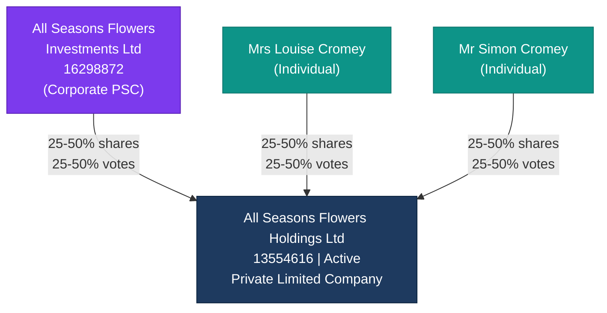

### Variant B: Top-down, minimal, no colours

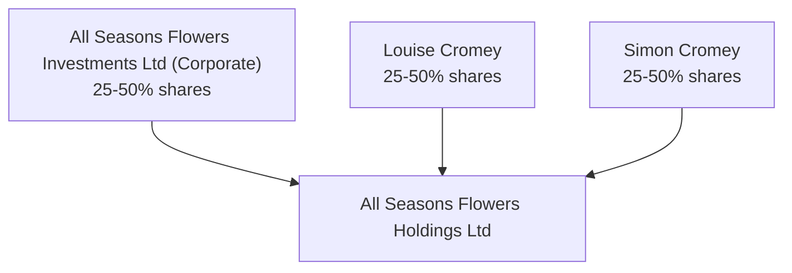

### Variant C: Left-to-right, badges for control type

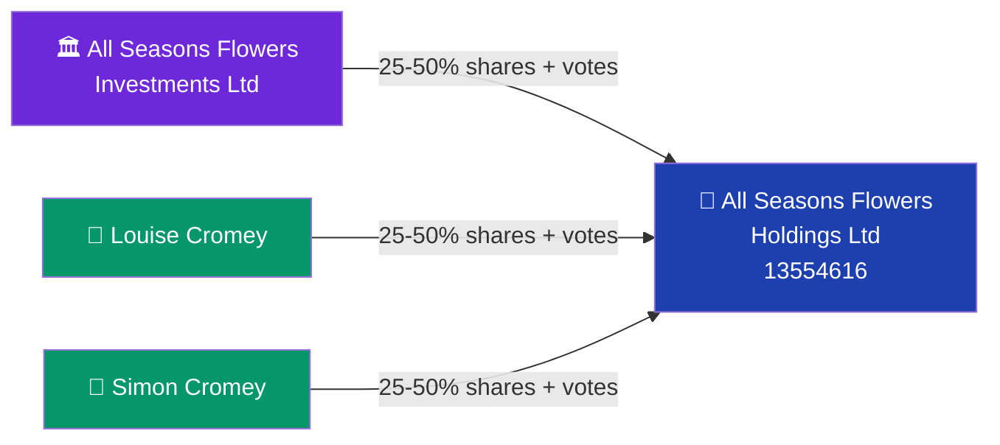

### Variant D: Top-down, with ceased PSCs shown as dashed

Real data from **Varley International Holdings Limited** (12075176) — shows ownership change over time.

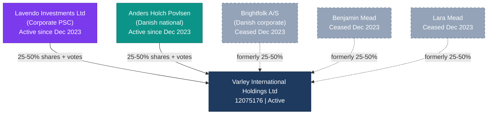

---

## 2. Officer Network Graphs

Real data from **Simon Cromey** — director of 4 companies (3 active, 1 resigned).

### Variant A: Left-to-right, status colour-coded

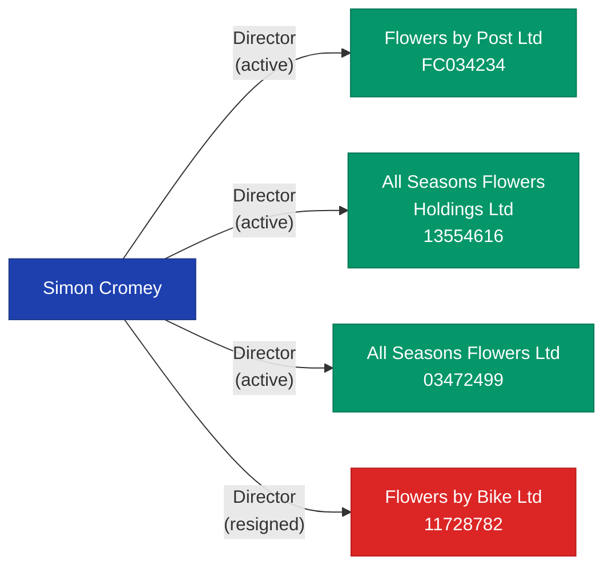

### Variant B: Left-to-right, minimal with role labels only

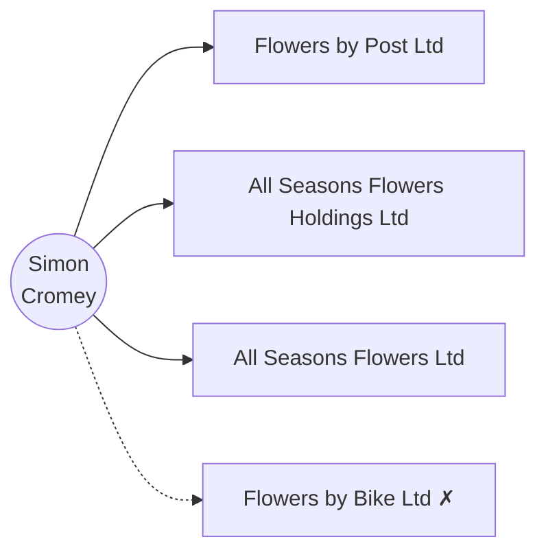

### Variant C: Top-down, grouped by status

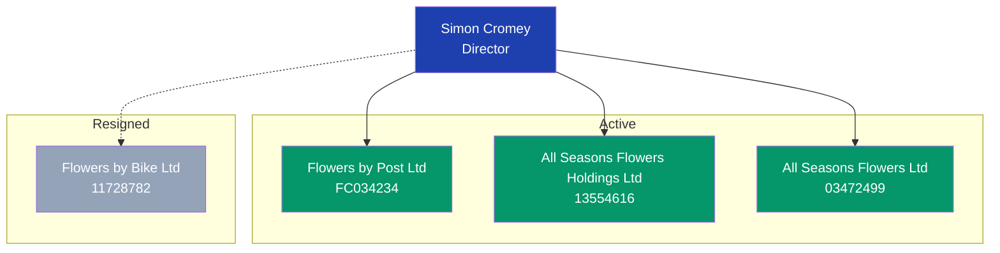

---

## 3. Filing Timeline

Real data from **BrewDog PLC** (SC311560) — curated key events from 2006 to 2026, showing the company's journey to administration.

### Variant A: Sectioned by category

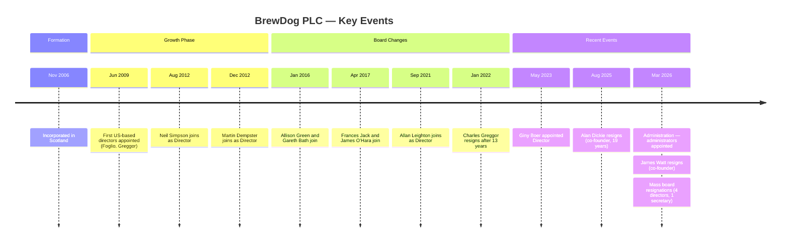

### Variant B: Flat timeline, dates and events only

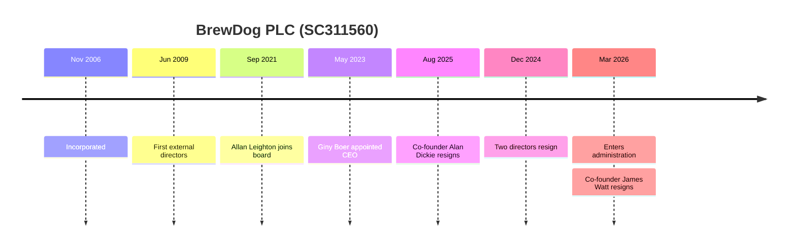

---

## 4. Officer Tenure (Gantt)

Real data from **BrewDog PLC** (SC311560) — directors only, showing the full board history. BrewDog was incorporated Nov 2006 and entered administration Mar 2026.

### Variant A: Full board history, grouped by status

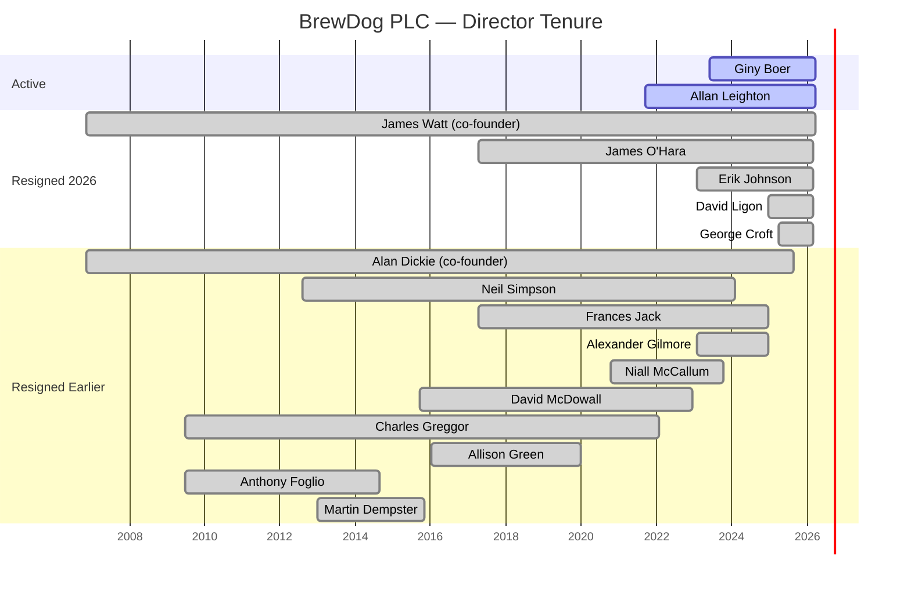

### Variant B: Simplified — co-founders and key directors only

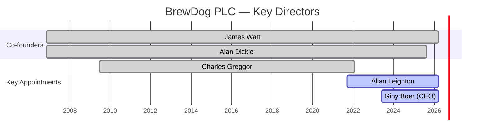

---

## 5. Due Diligence Risk (Quadrant)

Hypothetical example — a company with multiple flags at different severity levels.

### Variant A: Severity vs urgency matrix

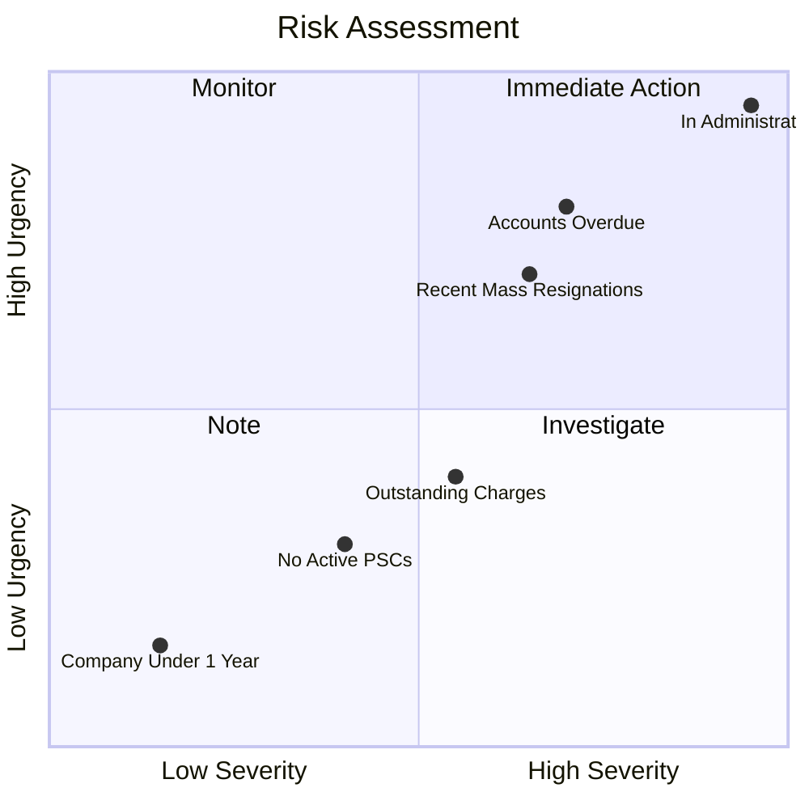

### Variant B: Simple severity only (pie chart of flag counts)

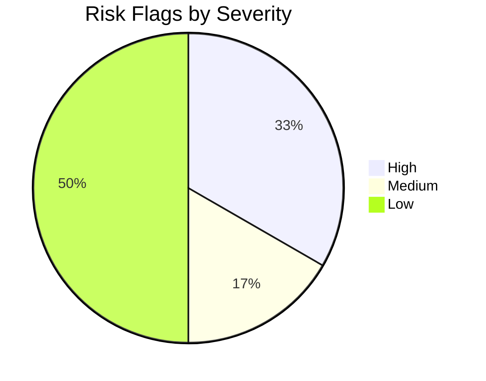

---

## 6. Charge Lifecycle

Real data from **Tesco PLC** (00445790) — 9 charges, showing outstanding vs satisfied.

### Variant A: Gantt-style timeline

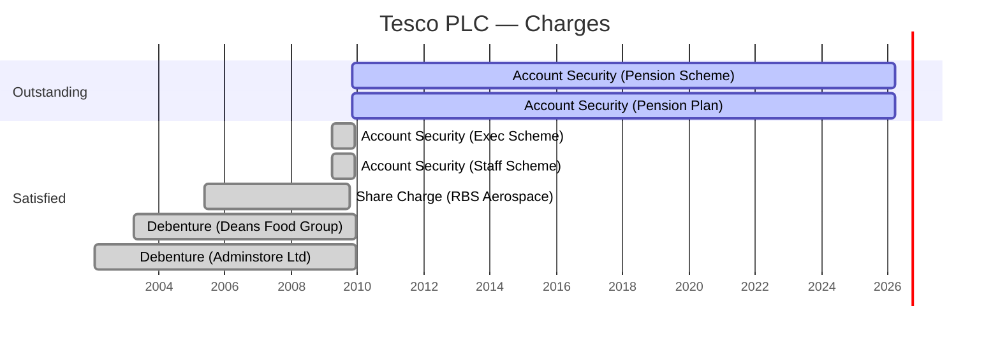

### Variant B: Flowchart showing current state

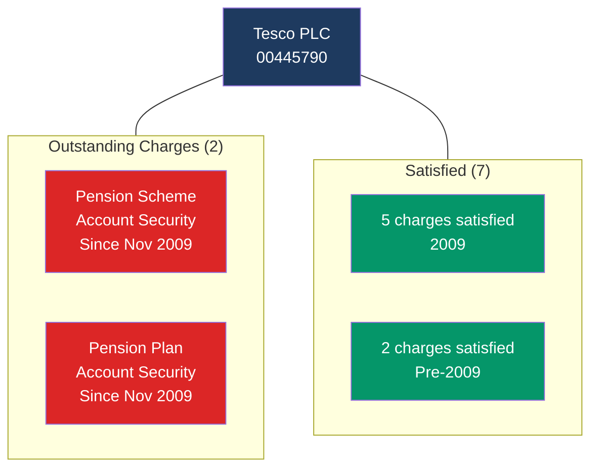

---

## What to tell me

For each section, note:
- Which variant you prefer (A, B, C, D)
- Anything you'd change (more/less detail, different colours, different layout direction)
- Whether the diagram type itself is worth including in the skill at all
- Any diagram types you want to see that aren't here
